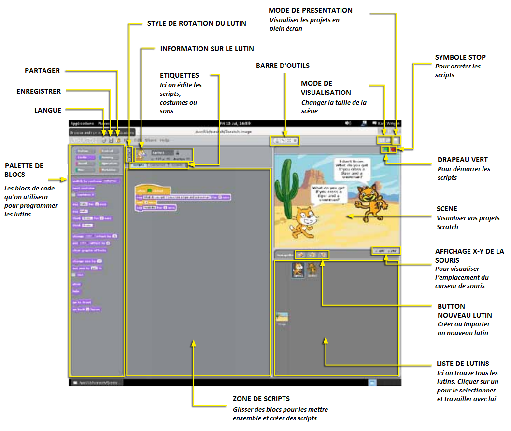
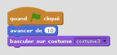

# Commencer avec Scratch

Scratch est un outil de programmation visuelle qui permet à l'utilisateur de créer des animations et des jeux dans une interface glisser-déposer. Cela nous permet de créer nos propres jeux vidéo, des histoires intéractives, et des animations en utilisant des techniques de programmation sans avoir vraiment à écrire des lignes de code. C'est une excellente façon pour initier les jeunes à la programmation avec un Raspberry Pi.

## Introduction

Vous trouverez Scratch dans le bureau de Raspbien ou Ubuntu Mate et ensuite dans **Education** du menu d'applications.  Quand vous l'ouvrez vous verrez une fenêtre comme celle-ci: 

## Faites bouger le chat Scratch

Le chat qui se trouve dans la fenêtre blanche est un exemple des **lutins** dans Scratch. Actuellemnt le chat de Scratch sprite est dans une **scène** vierge.  Faisons bouger le chat.

1. Cliquez sur sprite le chat de Scratch.
2. Ensuite cliquez sur les blocs de la palette et selectionnez **Evènements**.
3. Glissez le bloc **Quand le drapeau vert est cliqué** et mettez-le dans la zone de script au milieu de l'écran.
4. Ajoutez un bloc bleu **Avancer de 10** de la palette de blocs **Mouvement** et connectez-le au bloc **Quand le drapeau vert est cliqué** .
5. Maintenant cliquez l'image du drapeau vert qui se trouve en haut à droit de l'écran et regardez le chat bouger!
6. Pouvez-vous faire bouger le chat encore plus loin? 

## Changer l'apparence du lutin

Tous les lutins dans Scratch peuvent porter des costumes différents.

1. Cliquez sur le lutin pour le selectionner. Cliquez sur l'étiquette **Costumes** qui se trouve au milieu de l'écran.
2. Vous verrez que le chat a deux costumes. Cliquez sur Dupliquer pour créer un troisième costume. Un nouveau costume de chat doit apparaître.
3. Selectionnez **costume3** pour l'éditer. Amusez-vous à tester tous les boutons et outils pour trouver ce qu'ils font.
4. Ensuite, dessiner quelques vêtements dans le costume et cliquez sur **OK**.
5. Pour alterner entre les costumes, cliquez sur l'étiquette **Scripts**. Ajoutez le bloc violet **Apparence** , **Basculer sur costume**, glissez-le vers les autres blocs et connectez-le.
6. Selectionnez **costume3** dans le menu déroulant qui se trouve dans le bloc violet.
7. Maintenant faites tourner le programme pour voir que le costume change.

## Ajouter des lutins

Si le chat de Scratch ne vous convient pas, vous pouvez ajouter d'autres lutins ou même en créer vos propres!

1. Au dessus de la palette des lutins il y a trois icônes pour créer un nouveau lutin.
2. Le premier vous permet de **Dessiner un nouveau lutin**. Cliquez sur cela et la fenêtre d' **Editeur de la peinture** s'ouvrira. Ici vous pouvez utiliser des formes, lignes et dessins libres pour créer vos lutins.
3. Le second icône vous permet de **Choisir un nouveau lutin** de ceux qui existent déjà dans Scratch ou qui ont été enregistrés dans votre Raspberry Pi. Cliquez sur cela et vous serez capables de naviguer dans les fichiers qui contiennent ces lutins et ensuite selectionner celui que vous souhaitez.
4. Le troisième icône , quand cliqué, vous donnera un **lutin surprise**.  Cliquez-le et vous verrez ce qui se passera!

## What next?
- Now you know the basics of the Scratch, why not try completing the [Robot Antenna Resource](http://www.raspberrypi.org/learning/robot-antenna/) to make an LED blink.
- You could also try creating a button using candy sweets with the [Sweet Shop Reaction Game Resource](http://www.raspberrypi.org/learning/reaction-game/)
